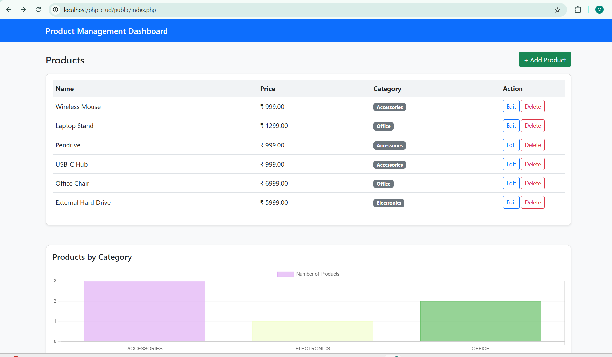
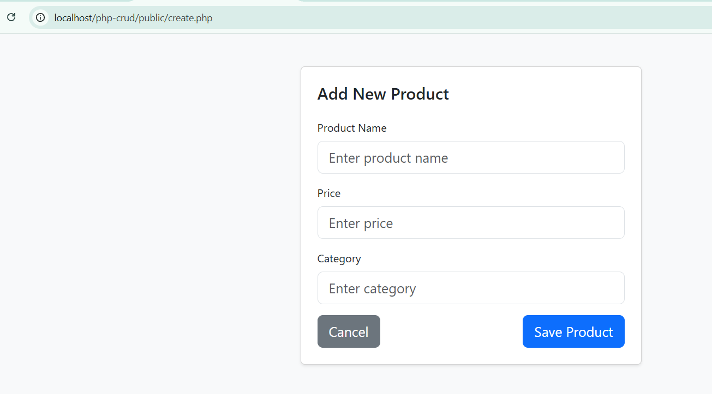
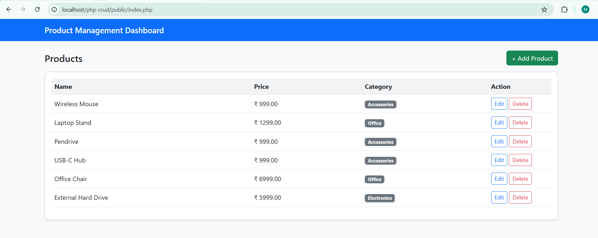
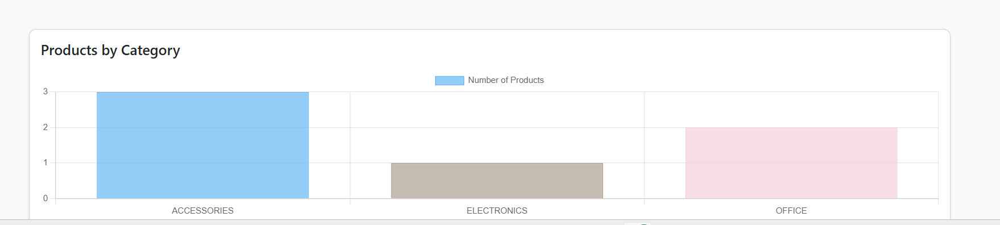
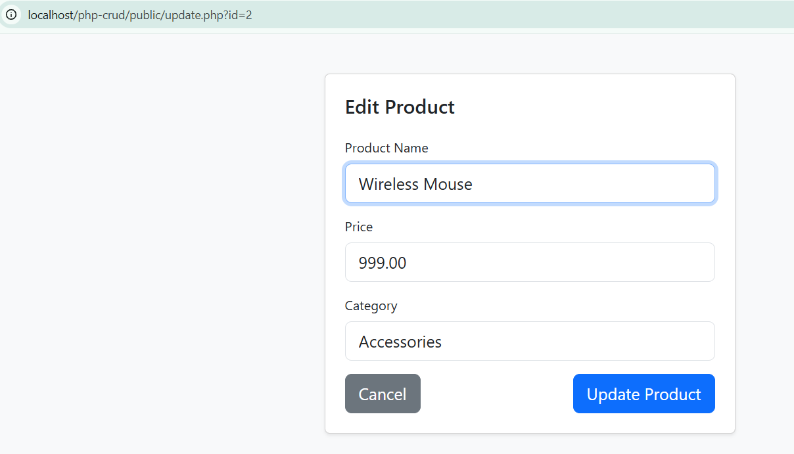

# PHP MySQL CRUD Application with MYSQL & Chart.js

## Project Overview
This project is a full-stack CRUD (Create, Read, Update, Delete) application developed using PHP, MySQL, Bootstrap, and Chart.js.  
It allows users to manage products efficiently and visualize data using a dynamic bar chart.

This application was created as part of a technical assignment to demonstrate PHP backend development, database handling, and basic data visualization skills.

## Tech Stack
- Frontend: HTML, CSS, Bootstrap
- Backend: PHP
- Database: MySQL (phpMyAdmin)
- Visualization: Chart.js

## Features
- Create, read, update, and delete products
- Auto-increment product ID
- Input validation and basic error handling
- Responsive UI using Bootstrap
- Dynamic bar chart based on product categories

## Chart Functionality
- Displays the number of products per category
- Automatically updates when CRUD operations are performed
- The bar chart shows total number of products per category
- Categories are normalized to avoid duplicates (case and spacing issues)
- Data is fetched from chart-data.php in JSON format
- Chart updates automatically when any CRUD operation is performed

## Example:
- Accessories: 2 products → 1 bar
- Office: 1 product → 1 bar

## How to Run
1. Install XAMPP
2. Start Apache and MySQL
3. Import the database using phpMyAdmin
4. Place the project folder inside `htdocs`
5. Open a browser and visit:
   http://localhost/crud-app/public/index.php

## Screenshots

## How the Bar Chart Works

- The bar chart shows total number of products per category
- Categories are normalized to avoid duplicates (case and spacing issues)
- Data is fetched from chart-data.php in JSON format
- Chart updates automatically when any CRUD operation is performed

## Example:
- Accessories: 2 products → 1 bar
- Office: 1 product → 1 bar

